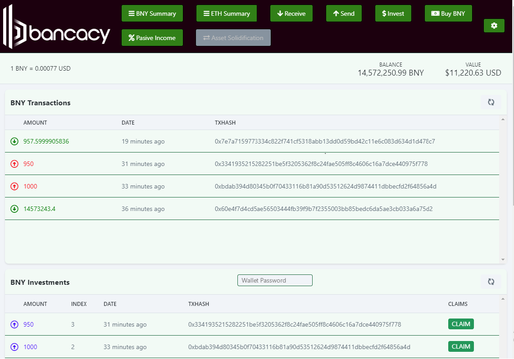

## KUBOCOIN Desktop Wallet

Lunamonkey is happy to provide a private test version with an easy to use, cross-platform, secure desktop wallet for sending, receiving and storing your KUBOCOIN Tokens. This software is provided with no warrenty and should be used for experimental purposes only. This software has been forked under MIT licence from BTK (Bitcoin Token).

## Features Include

- Initial account security with a 12-word seed phrase.
- Import and Export functionality of the seed phrase for easy backup/restore.
- Auto-recommendation of sending gas fee for the novice users.
- Clean, simple user interface.

This wallet is exclusive to KUBOCOIN tokens, you can't load other ERC-20 tokens into this wallet.

## Screenshots

## Security Vulnerabilities

If you discover a security vulnerability within the wallet, please send a note to Lunamonkey via issues and comments. All security vulnerabilities will be promptly addressed.

## License

The web wallet is open-sourced software licensed under the [MIT license](https://opensource.org/licenses/MIT).

## Developers

Using Visual Studio, open the Solution and run

npm install
------
npm run dev
or
npm run build

